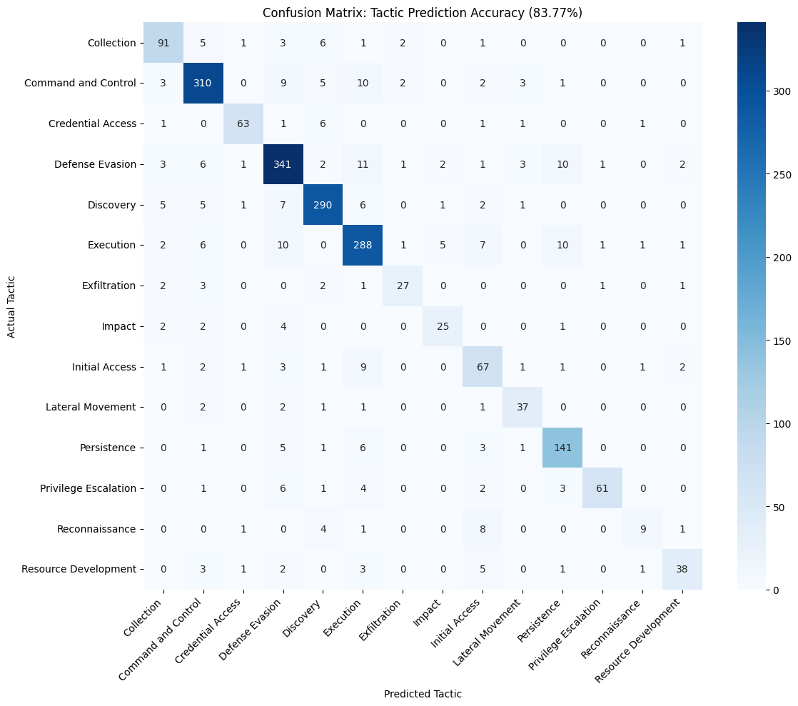

# MITRE ATT&CK TTP Classifier

A final-year project that maps free-text threat descriptions to MITRE ATT&CK **Tactics** and **Techniques** using a two-stage NLP pipeline.

---

## How It Works

1. **Stage 1** — classifies a sentence into one of 14 MITRE ATT&CK tactics
2. **Stage 2** — predicts the specific technique (from 255), constrained to only techniques belonging to the Stage 1 tactic via a logit mask
3. **Enricher** — adds MITRE definitions, severity level, and a reference link from the ATT&CK STIX bundle

Results are marked `passed`, `flagged_stage1`, or `flagged_stage2` depending on whether confidence clears the threshold (default 0.80).

---

## Structure

```
backend/        FastAPI API  (pipeline.py, reporter.py, app.py)
frontend/       Streamlit UI (streamlit_app.py)
model/          Training notebooks + datasets (model weights not included)
original_datasets/  Raw MITRE ATT&CK dataset
```

---

## Model Setup (Required before running)

The model weights are not included in this repository. To generate them, run the training notebooks:

- `model/First_stage_classification/cisco-ai.ipynb` — trains the Stage 1 tactic classifier
- `model/second_stage_classification/cisco_ai_implementation.ipynb` — trains the Stage 2 technique classifier

The notebooks were originally trained on Kaggle using GPU acceleration, so training locally may take a significant amount of time depending on your hardware.

Since it is train in Kaggle, the way kaggle setup if different as well. To train the model, you will need to train in kaggle instead

---

## Running

```bash
# Backend (http://localhost:8000)
cd backend
pip install -r requirements.txt
uvicorn app:app --reload

# Frontend (http://localhost:8501)
cd frontend
pip install -r requirements.txt
streamlit run streamlit_app.py
```

> On first start the MITRE ATT&CK STIX bundle (~30 MB) is downloaded once and cached at `backend/storage/enterprise-attack.json`.

---

## API

| Method | Path | Description |
|--------|------|-------------|
| GET | `/health` | Backend + model status |
| POST | `/predict` | Classify a single sentence |
| POST | `/predict/batch` | Classify a list of sentences |

```json
POST /predict
{ "sentence": "The attacker dumped LSASS memory to extract credentials.", "threshold": 0.80 }
```

---

## Frontend

- **Analyse Article** — paste any URL; the app extracts and classifies every sentence, grouping results into confirmed TTPs and flagged items
- **Classify Sentence** — instant single-sentence classification with confidence scores and a MITRE ATT&CK reference link
- **Sidebar** — analysis history and adjustable confidence/noise thresholds

---

## Results

### Stage 1 — Tactic Classification

**Overall accuracy: 83.77% | Weighted F1: 0.86**




Notable per-class results:

| Tactic | Precision | Recall | F1 |
|---|---|---|---|
| Discovery | 0.91 | 0.91 | 0.91 |
| Privilege Escalation | 0.95 | 0.78 | 0.86 |
| Defense Evasion | 0.87 | 0.89 | 0.88 |
| Reconnaissance | 0.69 | 0.38 | 0.49 |
| Impact | 0.76 | 0.74 | 0.75 |

Reconnaissance and Impact score lower, likely due to limited training samples (24 and 34 respectively).
